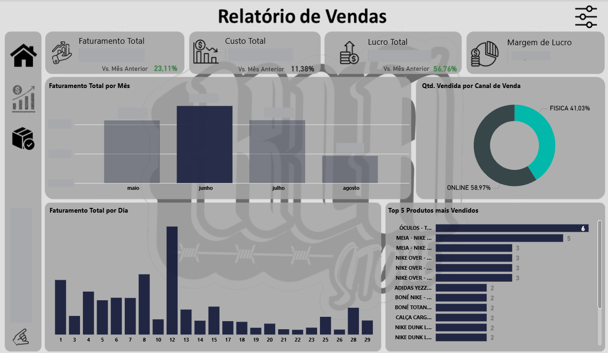
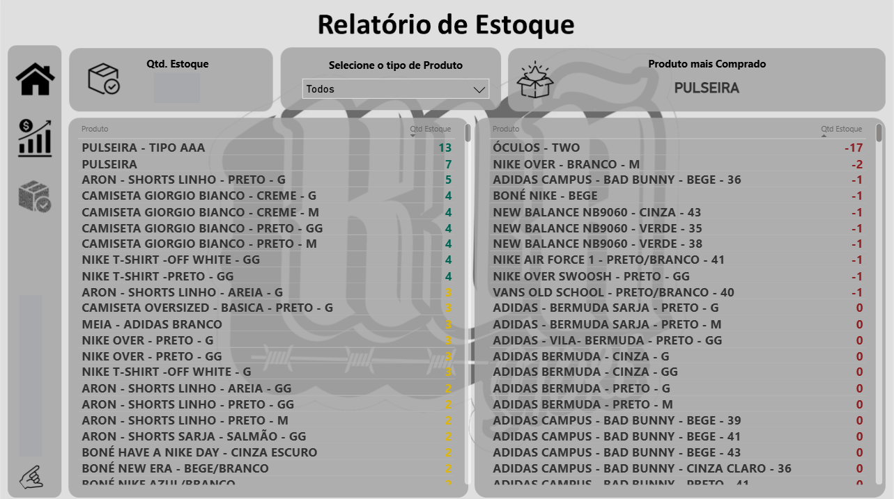

# 📊 Análise Comercial e Estoque — Loja de Vestuário (Power BI)

Projeto de Business Intelligence focado em **reestruturação de dados desorganizados**, **automação de ETL** e **construção de dashboard gerencial** para apoiar decisões comerciais e de estoque.

---

## 🎯 Contexto do Problema
A loja possuía bases com **formatação inconsistente**, ausência de **padrão de preenchimento** e falta de **identificadores únicos**, o que dificultava análises confiáveis e aumentava o risco de erros no reporting.

---

## ✅ Objetivo do Projeto
- Padronizar e reestruturar as bases para análise
- Criar **identificadores únicos de produtos**
- Automatizar tratamento de **nulos** e **campos em branco** no ETL
- Desenvolver um dashboard com **KPIs comerciais** e **visão de estoque**
- Publicar no Power BI Service com **atualização automática via Gateway**

---

## 🔄 Abordagem (End-to-End)

### 1) Reestruturação e Padronização (Excel + Power Query)
- Ingestão dos dados antigos e reorganização em novas tabelas no Excel
- Padronização de colunas e formatos para reduzir inconsistências
- Criação de **ID único de produto** via Power Query
- Análise exploratória (EDA) para validar qualidade e necessidades de ajuste

### 2) ETL no Power BI (Power Query)
Foco em garantir consistência e reduzir erros de inserção:
- Tratamento de valores em branco e campos nulos
- Padronização de campos críticos para consumo no dashboard
- Automatização de etapas do ETL para evitar retrabalho e inconsistências

### 3) Prototipação (Figma + PowerPoint)
- Prototipação do layout com foco em **leitura limpa** e **identidade visual da loja**
- Aprovação com o cliente antes do desenvolvimento final

### 4) Desenvolvimento do Dashboard (Power BI)
- Construção de KPIs e visuais alinhados em reuniões com o cliente
- Complementação das necessidades com boas práticas analíticas

---

## 📌 KPIs e Métricas
**KPIs principais (cards):**
- Faturamento
- Custo
- Lucro
- Margem de lucro
- Comparativo MoM (mês contra mês)

**Análises e visuais:**
- Faturamento mensal (análise temporal)
- Faturamento diário (comportamento ao longo do mês)
- Top 10 produtos mais vendidos
- Quantidade vendida por canal (gráfico de rosca)
- Tooltips com: **Faturamento, Quantidade Vendida e Ticket Médio**

## 🧮 Principais Medidas DAX

Abaixo estão algumas das principais medidas utilizadas no dashboard para construção dos indicadores comerciais.

---

### 📦 Quantidade Vendida

```DAX
Qtd. Vendida = SUM('Vendas (2)'[Qtd. Vendida])
```

**Objetivo:** mensurar o volume total de itens vendidos.

---

### 💵 Custo Total

```DAX
Custo Total = SUM('Compras (2)'[Valor Total])
```

**Objetivo:** acompanhar o custo agregado das vendas para análise de rentabilidade.

---

### 📈 Lucro

```DAX
Lucro Total = [Faturamento Total] - [Custo Total]
```

**Objetivo:** identificar o ganho financeiro líquido das operações de venda.

---

### 📊 Margem de Lucro (%)

```DAX
Margem % = DIVIDE([Lucro Total], [Faturamento Total])
```

**Objetivo:** avaliar a eficiência das vendas em termos percentuais de rentabilidade.

---

### 🧾 Valor Médio Produto

```DAX
Valor Médio = DIVIDE([Faturamento Total], [Qtd. Vendida])
```

**Uso no projeto:** exibido nos tooltips do gráfico temporal para enriquecer a análise de vendas.

---

### 📉 Faturamento Mês Anterior

```DAX
Faturamento Mês Anterior =
CALCULATE(
    [Faturamento Total],
    DATEADD(dCalendario[Data], -1, MONTH)
)
```

**Objetivo:** servir de base para comparação temporal MoM.

---

### 🚀 Crescimento MoM (%)

```DAX
VAR vCrescimento_Fat =
DIVIDE([Faturamento Total]-[Faturamento Mês Anterior],[Faturamento Mês Anterior],"N/A")
RETURN

IF(
    HASONEVALUE(
        dCalendario[Mes]) && vCrescimento_Fat <> BLANK(),
        vCrescimento_Fat,
        "N/A"
)
```

**Objetivo:** acompanhar a evolução mensal do faturamento, permitindo rápida identificação de crescimento ou retração.

---

## 📄 Páginas do Relatório

### Página 1 — Comercial
- KPIs comerciais + MoM
- Faturamento mensal com tooltips (faturamento, Qtd Vendida e ticket médio)
- Faturamento diário para identificar padrões e apoiar ações de marketing
- Top 10 produtos mais vendidos
- Quantidade vendida por canal

### Página 2 — Estoque
- Tabelas de produtos e quantidade em estoque
- Formatação condicional por nível de estoque:
  - **Verde:** estoque ok
  - **Amarelo:** atenção
  - **Vermelho:** ruptura/baixo estoque
- Filtro por tipo de produto
- Card com quantidade total em estoque
- Indicador de produto mais comprado

---

## 🖼️ Prints do Dashboard

> **Observação:** para fins de portfólio, este repositório contém apenas imagens do dashboard (sem dados e sem PBIX).

### Página Comercial


### Página Estoque


---

## ☁️ Publicação
Dashboard publicado no **Power BI Service**, com **atualização automática via Gateway**.

---

## 🛠️ Tecnologias Utilizadas
- Power BI
- Power Query (Excel e Power BI)
- Excel
- Figma
- PowerPoint
- Power BI Service + Gateway

---

## 🔐 Nota sobre Dados
Por questões de confidencialidade, **dados e arquivos do modelo (.pbix)** não foram publicados. O projeto é apresentado via prints e documentação.

---

## 📬 Contato
Se quiser trocar ideia sobre o projeto ou oportunidades:
- **LinkedIn:** (https://www.linkedin.com/in/gabriel-souzaa10/)
- **E-mail:** (gabrielsouza1950@hotmail.com)

  
